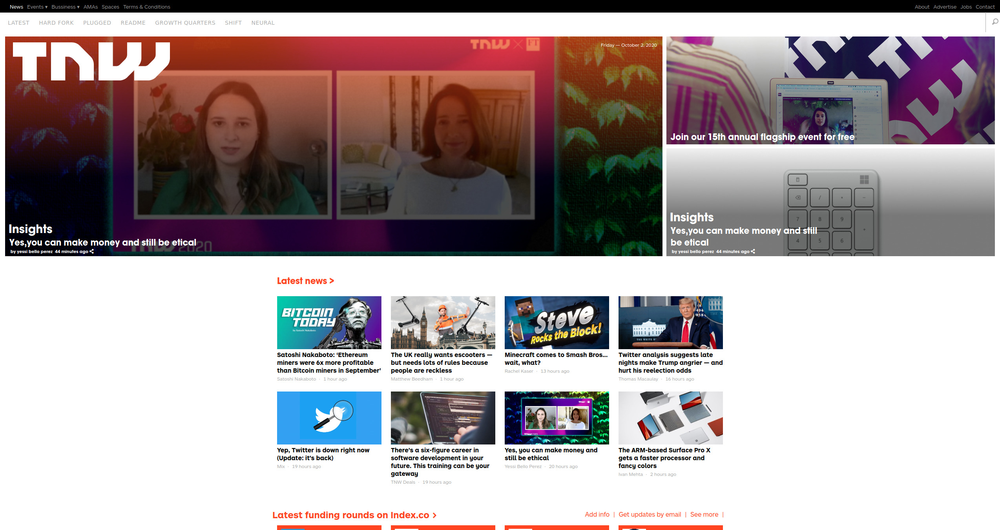

# The Next Web Website Clone

> This project is responsive clone of the The Next Web website.

## Built With

- HTML
- CSS
- Font Awesome
- Javascript

## Live Demo

[Live Demo Link](https://sinansevgi.github.io/NextWebClone/)

## Authors

👤 **Oluwadare Juwon**

- GitHub: [@wintan1418](https://github.com/wintan1418)
- Twitter: [@juwonoluwadare](https://twitter.com/oluwadarejuwon)
- LinkedIn: [Oluwadare Juwon](https://www.linkedin.com/in/oluwadare-juwon-048a391a8/)

👤 **Sinan Sevgi**

- GitHub: [@sinansevgi](https://github.com/sinansevgi)
- LinkedIn: [@sinansevgi](https://www.linkedin.com/in/sinan-s-52559437/)
- Twitter: [@nativeofcyber1](https://twitter.com/nativeofcyber1)

## �� Contributing
You can freely contribute to this project.
## Show your support
Give a ⭐️ if you like this project!
